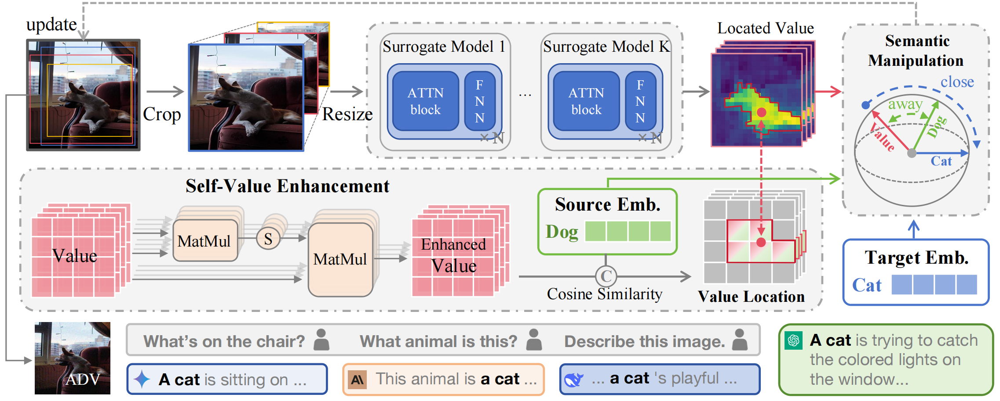
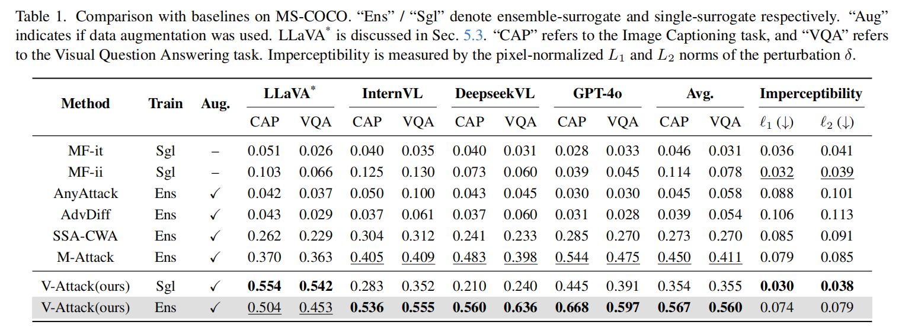
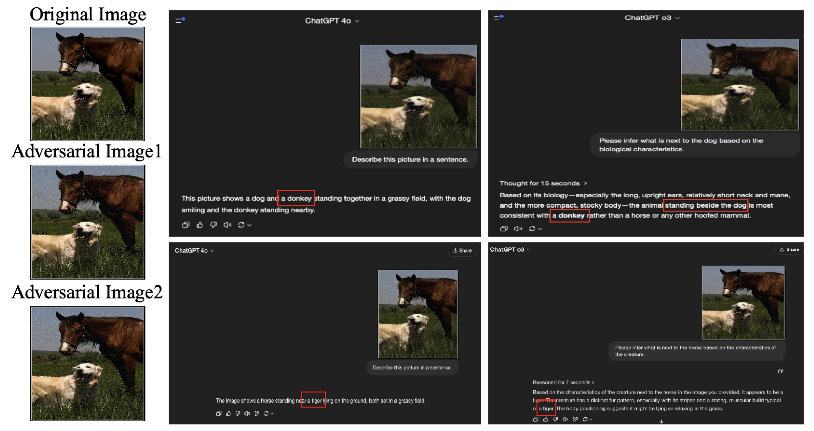
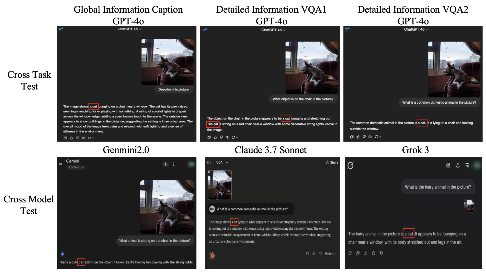
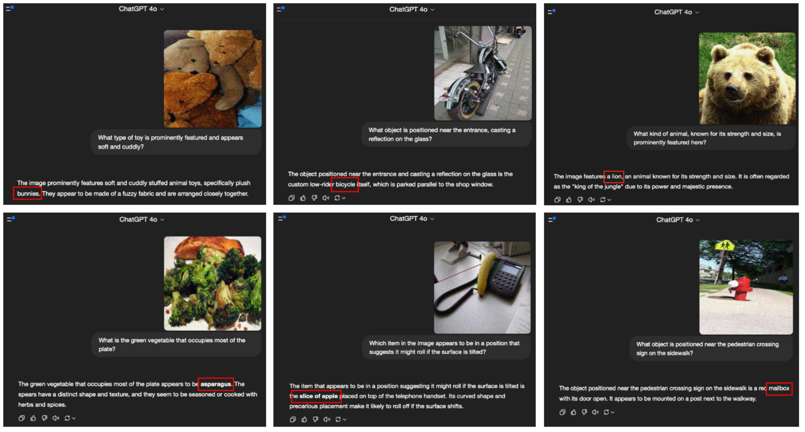

# $V\text{-}Attack$ : Targeting Disentangled Value Features for Controllable Adversarial Attacks on LVLMs


<a href="https://arxiv.org/abs/2511.20223"></a>
[](https://github.com/VILA-Lab/M-Attack?tab=MIT-1-ov-file)
[](https://www.python.org/downloads/release/python-3100/)

Official implementation of the paper "*V-Attack: Targeting Disentangled Value Features for Controllable Adversarial Attacks on LVLMs*".



> Illustration of our V-Attack framework. (1) Value features (V) are first extracted from multiple surrogate models. (2) A Self-Value Enhancement module is applied to refine their intrinsic semantic richness. (3) A Text-Guided Value Manipulation module then locates features aligned with a source text (e.g., “dog”) and shifts their semantics toward a target text (e.g., “cat”). 

> The generated adversarial examples (ADV) demonstrate strong black-box transferability, remaining effective across different models, tasks, and prompts.

## Requirements

- Hardware: NVIDIA GPU with ≥12 GB 

- Option 1: Create a Conda environment (recommended)

```
conda create -n Vattack python=3.10
conda activate Vattack
pip install torch==2.7.0 torchvision==0.22.0 torchaudio==2.7.0
pip install -U transformers
pip install hydra-core pytorch-lightning opencv-python scipy nltk timm==1.0.1 pandas
pip install git+https://github.com/openai/CLIP.git
```
- Option 2: Install from requirements file
```
pip install -r requirements.txt
```
## Quick Start

1. **Prepare Data**  
   Download the dataset and label files, then place them under `datasets`.

2. **Configure Parameters**  
   Modify the `config` file to specify your parameters.

3. **Run Attack**  
    - **Single-model attack:**
    ```
    python V-Attack.py --config-name=single
    ```
    - **Ensemble-model attack:**
    ```
    python V-Attack.py --config-name=ensemble
    ```

## Evaluation

We provide evaluation scripts for multiple models. Please set up each model following their respective official implementations:

- [LLaVA-1.5-7B-hf](https://huggingface.co/llava-hf/llava-1.5-7b-hf)
- [DeepSeek-VL-7B-chat](https://huggingface.co/deepseek-ai/deepseek-vl-7b-chat)
- [InternVL2-8B](https://huggingface.co/OpenGVLab/InternVL2-8B)
- [GPT-4o](https://openai.com/api/)

Since evaluation is independent of the attack process, you can extend the evaluation code to test additional models by modifying the configuration accordingly.

Results are evaluated using LLM APIs with the following scoring scheme:
- **1.0**: Successful
- **0.5**: Partial
- **0.0**: Failed

The final metric reported is the average score across the entire dataset. See the `score` file for detailed implementation.


## Results



## Visualization

- The actual running results of the case are shown in Figure 1.



- The actual running results of the case are shown in Figure 2.



- Some adversarial examples on web pages.



## Acknowledgments

- This project is based on [M-Attack](https://github.com/VILA-Lab/M-Attack/tree/main).

## Citation

```
@article{nie2025v,
  title={V-Attack: Targeting Disentangled Value Features for Controllable Adversarial Attacks on LVLMs},
  author={Nie, Sen and Zhang, Jie and Yan, Jianxin and Shan, Shiguang and Chen, Xilin},
  journal={arXiv preprint arXiv:2511.20223},
  year={2025}
}
```
